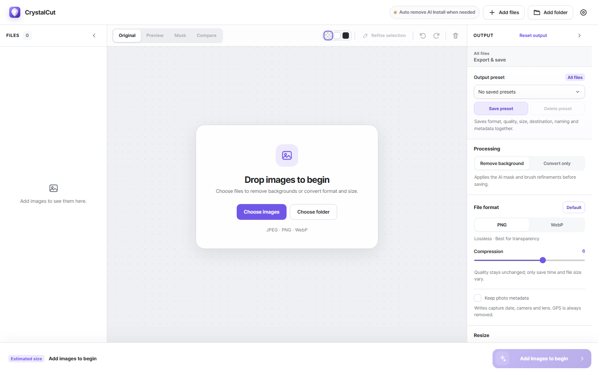
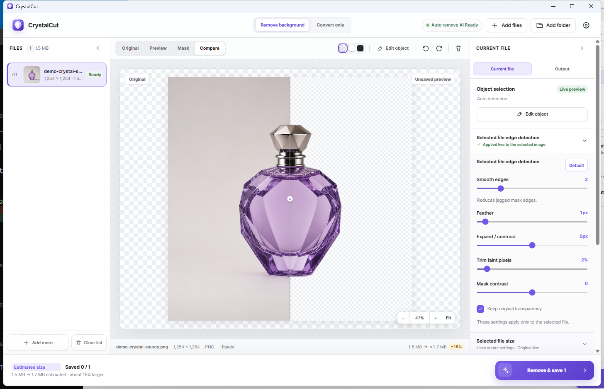
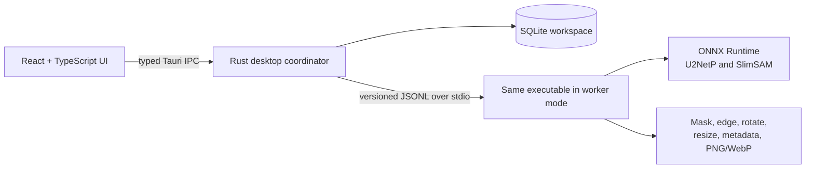

<p align="center">
  
</p>

<h1 align="center">CrystalCut</h1>

<p align="center">
  Fast, private background removal and batch image conversion for Windows and macOS.
</p>

<p align="center">
  
  
  
  
  
  
</p>

<p align="center">
  <a href="https://github.com/pkh31337/CrystalCut/releases/latest"><strong>Download</strong></a>
  ·
  <a href="#features">Features</a>
  ·
  <a href="#build-from-source">Build from source</a>
  ·
  <a href="#한국어-안내">한국어 안내</a>
</p>

<p align="center">
  <a href="CODE_SIGNING.md">Code signing policy</a>
  &nbsp;·&nbsp;
  <a href="PRIVACY.md">Privacy policy</a>
  &nbsp;·&nbsp;
  <a href="THIRD_PARTY_NOTICES.md">Third-party notices</a>
</p>

CrystalCut turns background removal into a practical desktop workflow. Add one image or a whole folder, inspect the result immediately, refine the selected object when necessary, and export optimized PNG or WebP files. Images remain on your computer; only pinned AI model files are downloaded on first use.



## Features

| Capability | What it provides |
| --- | --- |
| **Private by design** | Background removal, previews, masks, resizing, metadata handling, and encoding all run locally. Source images are never uploaded. |
| **Three selection modes** | Start with automatic detection, guide SlimSAM with include/exclude marks, or paint a selection manually from an empty mask. |
| **Live visual refinement** | Inspect the original, result, mask, or draggable comparison view while adjusting the selected file's edge settings. |
| **Efficient file management** | Immediate thumbnails, multi-selection, drag reordering, original/result export, safe cancellation, and unfinished-item retry. |
| **Flexible output** | Remove the background or convert only; resize, rotate, compress, rename, choose metadata, and save reusable presets. |
| **Native desktop experience** | A lightweight Tauri 2 shell, Rust image engine, native dialogs, app-specific context menus, and no console window in Windows release builds. |

## From files to finished assets

1. **Add images** — choose JPEG, PNG, or WebP files, add a folder, paste, or drag and drop.
2. **Select and refine** — use automatic detection, SlimSAM-assisted selection, or manual brushes; then tune edges per file.
3. **Preview accurately** — zoom, pan, fit, rotate, inspect the mask, or drag the comparison divider across the original and transparent result.
4. **Export once or in bulk** — apply output format, quality, dimensions, metadata, destination, and naming rules to selected files or the whole queue.

## Object selection and edge refinement

CrystalCut keeps the simple path one click away while exposing precise controls when a difficult image needs them.

- **Automatic detection:** U2NetP finds the primary foreground object without manual input.
- **AI object selection:** SlimSAM uses include and exclude brush marks to identify the intended object.
- **Manual selection:** begin with an empty mask and paint the area to keep.
- Keep/remove brushes with combined brush and plus/minus icons, adjustable size, undo, redo, and clear actions.
- Per-file smoothing, feathering, expand/contract, faint-pixel trimming, mask contrast, and original-alpha preservation.
- Opening or closing an accordion only changes the interface; it never enables, disables, or regenerates an effect.

## Preview that stays in context



- **Original, Preview, Mask, and Compare** views share one stable canvas and aspect ratio.
- The 100% zoom reference always uses the original image dimensions, even after transparent areas change the result bounds.
- Mouse-wheel and toolbar zoom, fit-to-window, and drag-to-pan navigation.
- Checkerboard, light, or dark preview backgrounds reveal transparent pixels correctly.
- The comparison divider exposes the transparent result instead of showing the original beneath removed pixels.
- Edge sliders and brush edits keep the Mask view active when that is the view being inspected.
- The selected file's dimensions, format, status, and estimated output size remain visible below the preview.

## Work list and multi-file operations

- Thumbnails are generated as soon as files are added.
- Use <kbd>Ctrl</kbd>/<kbd>Cmd</kbd> or <kbd>Shift</kbd> to select multiple items.
- Multi-selection opens a focused file-management view for exporting all selected originals or processed results.
- Drag one item or a selected group to reorder the queue; edge auto-scroll supports long lists.
- Keyboard and context-menu reordering remain available when dragging is inconvenient.
- Remove selected files, reveal them in the system file manager, copy paths, or clear the list from app-specific context menus.
- Workspace state is persisted in SQLite so interrupted jobs and unfinished items can be recovered safely.

## Output and conversion

### Formats, quality, and dimensions

- Input: **JPEG, PNG, WebP**
- Output: **PNG, lossy WebP, lossless WebP**
- Adjust WebP quality or PNG compression and review an estimated size change before export.
- Keep original dimensions, resize by percentage, or set the global long edge in pixels.
- Override the global resize for one file with either an output width or height. Aspect ratio stays locked and upscaling can be prevented.
- Rotate a selected image in 90-degree steps.
- Choose **Convert only** to preserve the background while applying rotation, resize, format, compression, metadata, naming, and destination rules.

### Destination, naming, and presets

- Save beside each original, in a new neighboring folder, or in one chosen folder.
- Add a prefix or suffix, or create a reusable file-name template.
- Available tokens: `{name}`, `{prefix}`, `{suffix}`, `{taken:yyMMdd_HHmmss}`, `{seq:03}`, `{camera}`, `{lens}`.
- Missing EXIF values resolve deterministically to `undated`, `unknown-camera`, and `unknown-lens`.
- Existing files are never overwritten silently; CrystalCut creates `name (2).png`, and so on.
- Save and restore the entire output configuration as a preset.

### Metadata and privacy

CrystalCut reads a focused metadata summary for review, orientation, and naming: capture date, camera, lens, description, recognized generation prompt/workflow, and GPS coordinates. Output metadata is rebuilt field by field instead of copying an opaque EXIF block.

- Preserve safe capture details and descriptions globally or override the policy for one selected file.
- GPS location and generation prompts are separate opt-in choices and are disabled by default.
- Edit important values for the selected file before export.
- Disabling metadata preservation also disables and clears its dependent GPS and prompt choices.
- Edits apply only to newly exported files; source files are never modified.

## Languages

CrystalCut follows the operating-system language by default and can be changed instantly in Settings.

- 한국어
- English
- 日本語
- 简体中文
- 繁體中文
- Español
- Deutsch
- Français
- Português (Brasil)

All 446 interface messages—including toasts, errors, confirmations, context menus, tooltips, and accessibility labels—are complete in every locale. An automated consistency check fails the build if a locale is missing a message or if an untranslated Korean UI literal escapes the catalogs.

## Download and installation

Open [GitHub Releases](https://github.com/pkh31337/CrystalCut/releases/latest) and choose the package for your computer:

- **Windows x64:** use `setup.exe` for a standard installation or `.msi` for managed deployment.
- **macOS Apple Silicon:** for Macs with M1, M2, M3, M4, or newer Apple chips.
- **macOS Intel:** for older Intel-based Macs.

Windows community installers are currently unsigned, so SmartScreen may ask you to confirm the first launch. The application inside every macOS package is code-signed: release builds use a Developer ID certificate and Apple notarization when the repository credentials are configured, and otherwise use an ad-hoc signature to keep the downloaded application bundle intact. An ad-hoc-signed build can still require confirmation in **System Settings > Privacy & Security**.

### Code signing policy

Windows signing through the SignPath Foundation is being prepared and is not yet active. A release is signed only when its release notes explicitly say so. See the [code signing policy](CODE_SIGNING.md) for the official artifact scope, build provenance, and the author, reviewer, and signing-approver roles. CrystalCut's local data handling and model-download behavior are documented in the [privacy policy](PRIVACY.md).

The U2NetP and SlimSAM model files are not bundled in the installer. They are downloaded only when required, verified against pinned size and hash metadata, and cached in the application data folder. The first use of each AI feature therefore requires an internet connection; image processing itself stays local.

## Architecture



Heavy image work never runs in the UI process. The coordinator can restart the worker once after an unexpected communication failure, and it recognizes completed output without writing a duplicate. Workspace state uses SQLite WAL and is revalidated when the app opens.

## Build from source

### Prerequisites

- Node.js 20 or newer (release CI uses Node.js 22)
- Rust stable toolchain
- [Tauri 2 platform prerequisites](https://v2.tauri.app/start/prerequisites/) for Windows or macOS

### Run the desktop app

```powershell
git clone https://github.com/pkh31337/CrystalCut.git
cd CrystalCut
npm ci
npm run tauri dev
```

To inspect only the React interface in a browser:

```powershell
npm run dev
```

Native file inspection, AI inference, and export require the Tauri desktop runtime and are intentionally unavailable in browser-only mode.

## Validation and packaging

```powershell
npm run build
npm run check:release -- v1.0.4
cargo fmt --manifest-path src-tauri/Cargo.toml --check
cargo clippy --manifest-path src-tauri/Cargo.toml --all-targets -- -D warnings
cargo test --manifest-path src-tauri/Cargo.toml
npm run build:desktop
npm run build:bundle
```

- `npm run build:desktop` creates an unbundled production executable for local verification.
- `npm run build:bundle` creates the installers supported by the current operating system.
- Do not run `cargo build --release` directly. A build guard prevents a production executable from accidentally retaining the Vite development-server URL.

## Publishing a release

The tag-driven [release workflow](.github/workflows/release.yml) validates that the tag matches all application manifests, builds Windows x64 on Windows and both macOS architectures on macOS, verifies the macOS app signature and DMG integrity, and publishes the draft GitHub Release only after every native package succeeds.

Keep the version identical in:

- `package.json`
- `src-tauri/tauri.conf.json`
- `src-tauri/Cargo.toml`

Then validate and push an annotated tag:

```powershell
npm run check:release -- v1.0.4
git tag -a v1.0.4 -m "CrystalCut v1.0.4"
git push origin main
git push origin v1.0.4
```

> **Intel macOS note:** CrystalCut pins `ort` to `2.0.0-rc.10`, the newest compatible release that still publishes an `x86_64-apple-darwin` ONNX Runtime binary. Do not upgrade it independently while Intel macOS remains in the release matrix.

### macOS signing and notarization

DMG packages must be built on macOS; a Windows build machine cannot produce a distributable macOS application. `bundle.macOS.signingIdentity` therefore defaults to Tauri's ad-hoc identity (`-`), which prevents Apple Silicon from treating an entirely unsigned downloaded bundle as damaged.

For public distribution without a Gatekeeper override, enroll in the Apple Developer Program and add all of these GitHub Actions repository secrets:

- `APPLE_CERTIFICATE`: single-line base64 Developer ID Application `.p12` created with `openssl base64 -A -in certificate.p12`
- `APPLE_CERTIFICATE_PASSWORD`: password used when exporting the `.p12`
- `APPLE_SIGNING_IDENTITY`: full `Developer ID Application: ...` identity
- `APPLE_ID`: Apple Developer account email
- `APPLE_PASSWORD`: app-specific password for that Apple ID
- `APPLE_TEAM_ID`: Apple Developer Team ID

The workflow rejects a partially configured set so it cannot silently publish an unnotarized Developer ID build. When all six values are present, Tauri imports the certificate, signs the app, submits it to Apple for notarization, and staples the ticket before the release is published. Secrets remain in GitHub Actions and are never stored in the repository.

## Project layout

```text
assets/                 Brand source artwork
docs/                   Product, UX, model, and localization decisions
models/manifest/        Pinned background-removal model metadata
scripts/                Build and consistency checks
src/                    React UI and locale catalogs
src-tauri/src/          Rust coordinator, worker, inference, and image pipeline
.github/workflows/      Cross-platform GitHub Release automation
```

## Current limitations

- U2NetP is the lightweight baseline; hair, fur, glass, and other difficult edges may still need manual refinement.
- Processing is CPU-first. DirectML and CoreML execution remain disabled until quality and recovery behavior are validated.
- The first model download duration depends on network speed.
- Windows installers are not yet code-signed. macOS uses ad-hoc signing by default and supports Developer ID signing and notarization through repository secrets.
- Third-party software and AI model terms must be reviewed before commercial redistribution.

Well-scoped bug reports are welcome. Include the OS, CPU architecture, CrystalCut version, model status, and diagnostics shown in Settings. Do not attach private source images unless you explicitly choose to share them.

## License

CrystalCut source code is available under the [Apache License 2.0](LICENSE). Third-party software and AI model assets retain their own licenses; review [THIRD_PARTY_NOTICES.md](THIRD_PARTY_NOTICES.md) before redistribution. The source-code license does not grant trademark rights to the CrystalCut name or logo. Official releases follow the [code signing policy](CODE_SIGNING.md) and the application follows the [privacy policy](PRIVACY.md).

## Documentation

- [제품 및 아키텍처 계획](docs/01_PRODUCT_ARCHITECTURE_PLAN.ko.md)
- [구현 현황](docs/02_IMPLEMENTATION_STATUS.ko.md)
- [수동 마스크와 설정 계획](docs/03_MANUAL_MASK_AND_SETTINGS_PLAN.ko.md)
- [SAM 통합 계획](docs/04_SAM_INTEGRATION_PLAN.ko.md)
- [서드파티 AI 모델 고지](docs/05_THIRD_PARTY_MODELS.ko.md)
- [UI/UX 검토 계획](docs/06_UI_UX_AUDIT_PLAN.ko.md)
- [다국어 구현 계획](docs/07_LOCALIZATION_IMPLEMENTATION_PLAN.ko.md)
- [ADR: Electron 대신 Tauri](docs/adr/01_tauri-over-electron.ko.md)

## 한국어 안내

CrystalCut은 Windows와 macOS에서 작동하는 로컬 우선 배경 제거·일괄 이미지 변환 앱입니다. 파일이나 폴더를 넣으면 자동으로 배경을 제거하며, 필요할 때 SlimSAM 객체 선택 또는 유지·제거 브러시로 결과를 세밀하게 보정할 수 있습니다.

- 원본·미리보기·마스크·드래그 비교 화면과 확대·축소·이동
- 선택 파일별 가장자리 감지 및 가로/세로 출력 크기 재정의
- 여러 파일 선택, 원본·결과 일괄 저장, 드래그 순서 변경
- PNG/WebP 형식, 화질·압축, 비율·긴 변 기준 크기 변경
- 같은 폴더·새 폴더·지정 폴더 저장과 EXIF 기반 파일명 템플릿
- 출력 프리셋, 작업 자동 복구, 안전한 취소·재시도
- 촬영 정보·GPS·생성 프롬프트의 전역/파일별 보존 및 편집 정책
- 시스템 언어 자동 감지와 9개 언어 지원

이미지는 외부 서버로 전송되지 않습니다. AI 모델은 최초 사용 시 한 번 다운로드하고 검증한 뒤 로컬 캐시에서 사용합니다. 일반 사용자는 [Releases](https://github.com/pkh31337/CrystalCut/releases/latest)에서 운영체제에 맞는 설치 파일을 받으면 됩니다.
